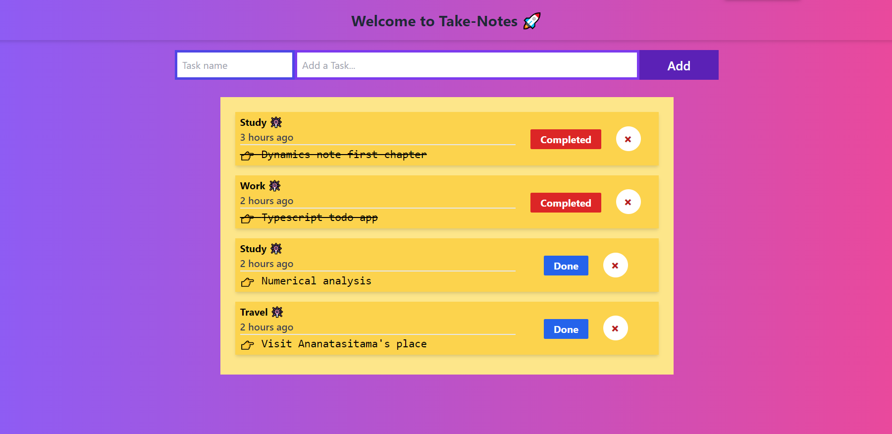

# Todo Application usiong typescript 🚀

## Frontend 🍿

- React with Typescript

## Backend 🗄️

- node, express with Typescript

## Features: 😎

- Create new Todo
- Update todo status
- Delete todo

`I Enjoyed doing this project a lot.... and fallen in love with typescript again! 💌 `

Images

